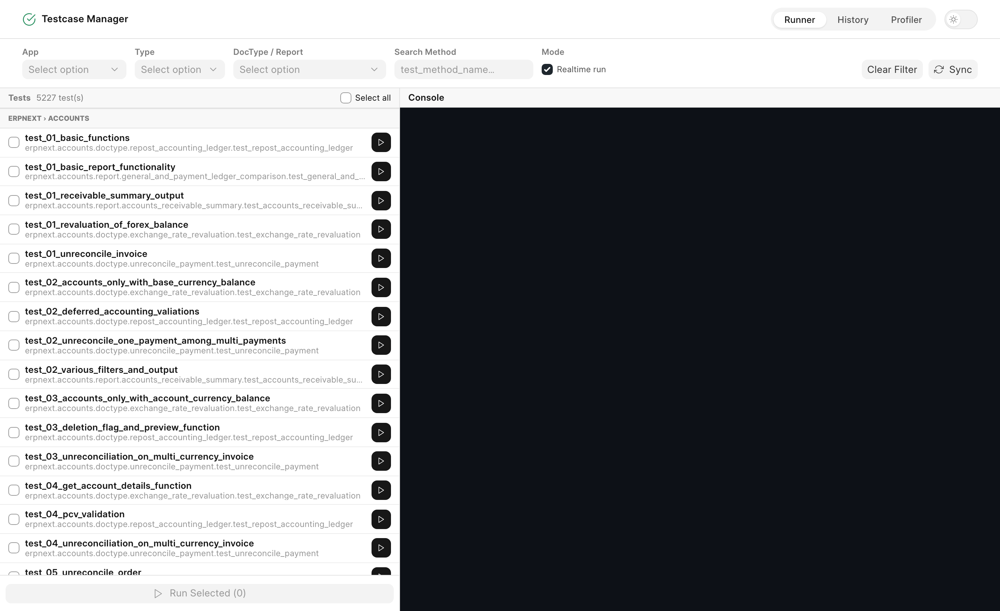
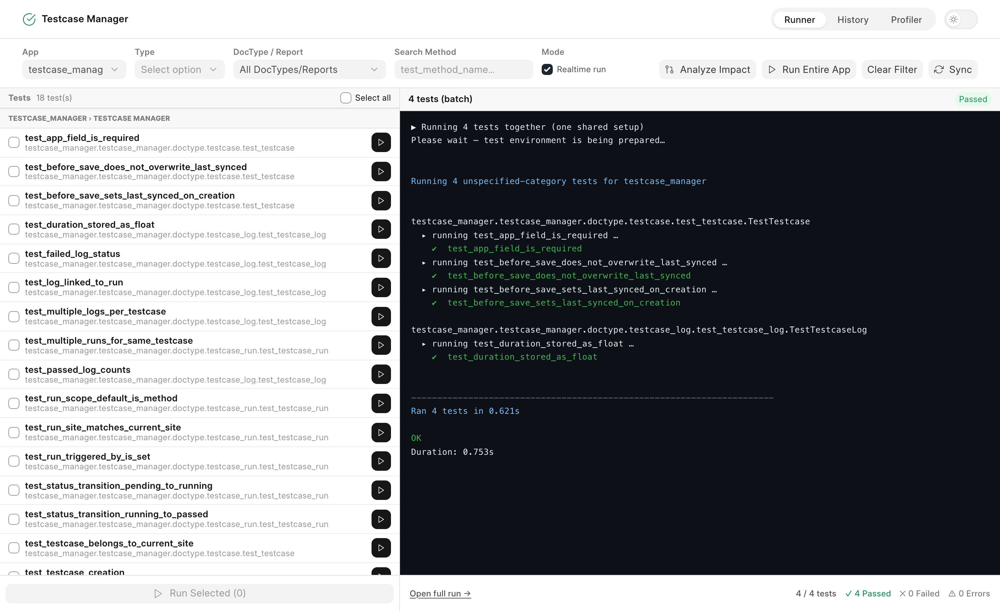
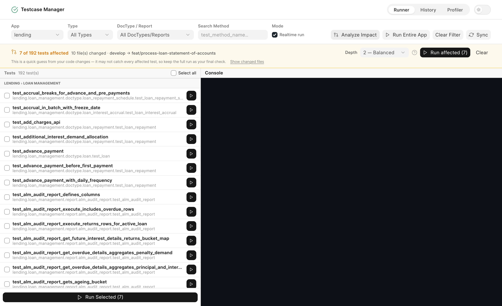
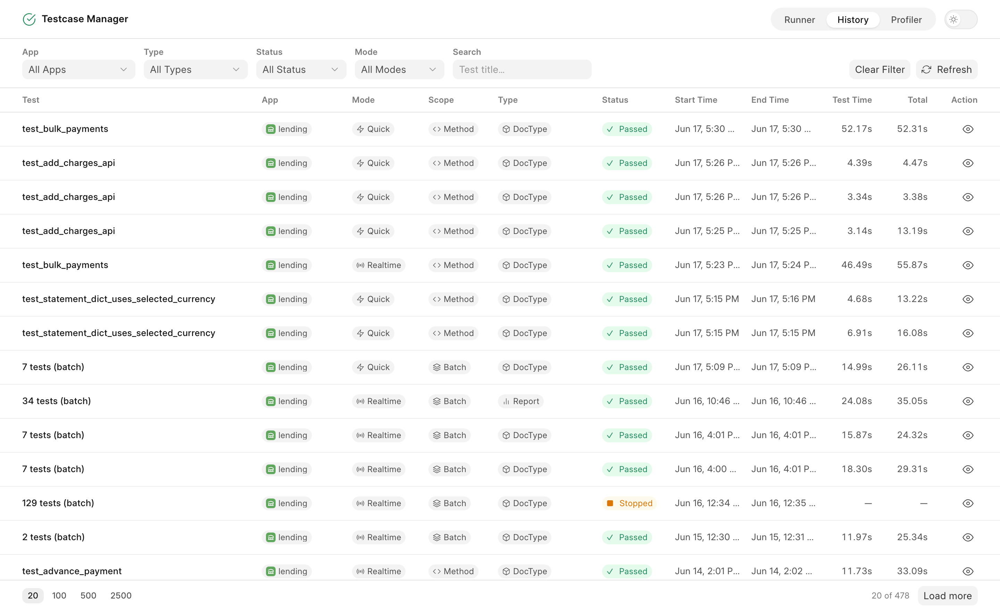
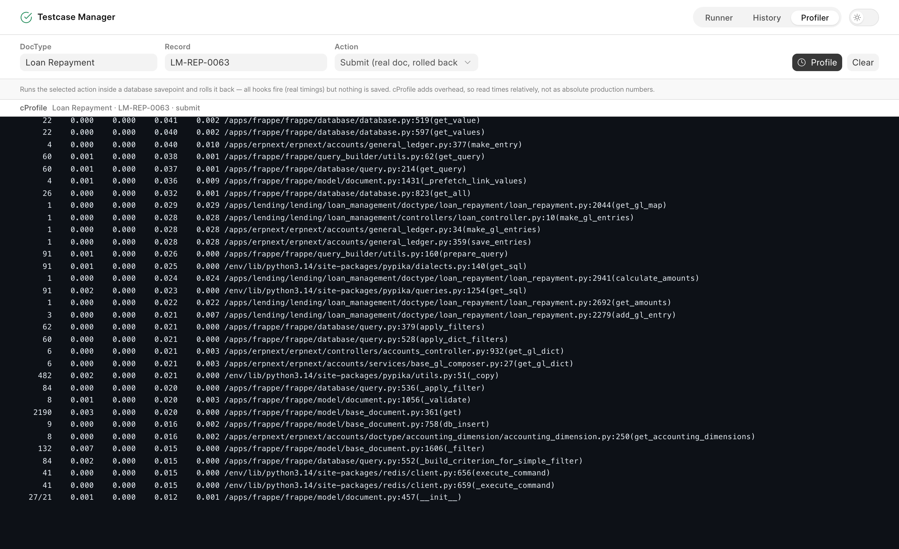

<div align="center" markdown="1">

<h1>Testcase Manager</h1>

**Discover, run, and track your Frappe tests from a modern web UI**

[](https://github.com/Nihantra-Patel/testcase_manager/actions/workflows/ci.yml)

</div>

---

## Overview

Running Frappe tests usually means dropping to a terminal, remembering the right
`bench run-tests` incantation, and reading scrollback to figure out what passed.
**Testcase Manager** replaces that workflow with a purpose-built web application.

It automatically discovers every `test_*.py` test across your installed apps,
stores each test method as a first-class record, and lets you run any test —
a single method, a whole DocType, or an entire app — from the browser. Output
streams to a live console in real time, and every run is saved with its full
output, pass/fail counts, and timing for later inspection.

The interface is a single-page application built with [Frappe UI](https://ui.frappe.io)
(Vue 3), served at `/testcase_manager`.

## Screenshots

**Runner** — discover, filter, select, and run tests with a live console.



A finished batch run, with per-test results streamed to the console:



**Test-impact analysis** — find which tests a branch's changes affect and run
just those, without executing anything during analysis.



**History** — a persistent, filterable record of every run.



**Profiler** — profile a document's `submit`/`cancel` and see where time goes,
without persisting anything.



## Who it's for

- **Developers** who want a faster feedback loop while writing tests, without
  leaving the browser or memorising CLI flags.
- **QA / reviewers** who need to run a specific suite and share a link to the
  result.
- **Teams** who want a persistent, searchable history of test runs on a site.

## Key Features

- **Automatic discovery** — finds `test_*.py` files across installed apps using
  AST parsing, so no test modules are imported (and no side effects run) during
  discovery.
- **Flexible run scopes** — execute a single **Method**, a whole **File**, all
  tests for a **DocType**, an entire **App**, or a **Batch** of hand-picked tests
  that share a single (expensive) environment setup.
- **UI (Cypress) tests** — discover and run an app's Cypress specs
  (`cypress/integration/*.js` and `ui_test_*.js`) from the same runner. Each run
  drives Frappe's `bench run-ui-tests` in a headless browser as a background job
  and streams its output to the live console, just like a Python run.
- **Realtime console** — test output streams live to the UI over websockets
  while the run is in progress.
- **Inline & background execution** — small selections run inline for instant
  feedback; large selections and whole-app runs are dispatched to background
  workers so the UI stays responsive.
- **Persistent history** — every run is recorded in `Testcase Run` (with full
  output, status, and duration) and `Testcase Log` (with pass/fail/error counts),
  browsable through a paginated, filterable History view.
- **Test-impact analysis** — before opening a PR, statically analyse a branch's
  git diff to find which tests are affected (via the import graph and DocType
  links) and run only those as a batch — no tests are executed during analysis.
- **Document profiler** — profile a single document's `submit` or `cancel`
  in-place using `cProfile`, run inside a savepoint that is rolled back so all
  hooks fire (real timings) but nothing persists. Replaces the manual
  `frappe.copy_doc(...); %prun doc.submit()` console workflow.
- **Stop control** — abort a queued or running job; partial output is preserved.
- **Automatic sync** — discovered tests are kept up to date after every
  migration and on a daily schedule.

## Architecture

Testcase Manager is a standard Frappe app with a Vue frontend.

```
testcase_manager/
├── frontend/                     # Vue 3 + Frappe UI single-page app (Vite)
│   └── src/
│       ├── pages/                # Runner, History, Run detail, Profiler views
│       ├── useTestRunner.js      # run lifecycle + realtime state (shared)
│       └── api.js                # typed wrappers over the whitelisted endpoints
└── testcase_manager/
    ├── testcase_manager/
    │   ├── api.py                # whitelisted endpoints consumed by the SPA
    │   ├── discovery.py          # AST-based Python test discovery & sync
    │   ├── ui_discovery.py       # globs Cypress specs (cypress/integration, ui_test_*.js)
    │   ├── executor.py           # runs Python tests in-process, streams realtime output
    │   ├── ui_executor.py        # runs Cypress specs via `bench run-ui-tests`, streams output
    │   ├── impact.py             # static test-impact analysis over the git diff
    │   ├── profiling.py          # cProfile-based document profiler (savepoint-isolated)
    │   ├── queries.py            # read-only list/lookup queries for the SPA
    │   └── doctype/              # Testcase, Testcase Run, Testcase Log
    ├── www/testcase_manager.html # built SPA entry page (generated)
    └── hooks.py                  # routing, scheduler, log retention
```

**Request flow**

1. **Discovery** (`discovery.py`) scans installed apps for `test_*.py` files and
   upserts every test method into the `Testcase` DocType.
2. The **frontend** lists those records and calls a whitelisted API method to
   start a run, which creates a `Testcase Run`.
3. The **executor** (`executor.py`) runs the selected tests in-process and
   publishes `test_output` / `test_completed` events via `frappe.publish_realtime`.
4. On completion, the run's full output, status, duration, and counts are
   persisted to `Testcase Run` and a `Testcase Log`.

### Data model

| DocType        | Purpose                                                              |
| -------------- | ------------------------------------------------------------------- |
| `Testcase`     | A discovered test method (app, module, path, reference DocType/Report). |
| `Testcase Run` | One execution (scope, status, timing, full output, traceback).      |
| `Testcase Log` | Result summary for a run (pass / fail / error counts, duration).    |

### Routing

`website_route_rules` in `hooks.py` maps `/testcase_manager/<path:app_path>` to
the SPA page (`www/testcase_manager.html`), so the Vue Router's history-mode
routes (`/`, `/history`, `/history/<run>`, `/profiler`) all resolve to the app.

### Automatic sync

Configured via `hooks.py`:

| Hook                       | Behaviour                                  |
| -------------------------- | ------------------------------------------ |
| `after_migrate`            | Full re-sync of discovered tests after every `bench migrate`. |
| `scheduler_events.daily`   | Daily full re-sync.                        |

### Log retention

`Testcase Run` and `Testcase Log` records are auto-cleared after **90 days**
via Frappe's `default_log_clearing_doctypes`.

## Built with

- [Frappe Framework](https://github.com/frappe/frappe) — full-stack web framework
  and test runner that powers discovery and execution.
- [Frappe UI](https://github.com/frappe/frappe-ui) — Vue 3 component library and
  data layer for the frontend.
- [Vite](https://vitejs.dev) — frontend build tooling.

## Requirements

- A working [Frappe Bench](https://github.com/frappe/bench) (Frappe v16+).
- **Python** ≥ 3.14
- **Node.js** 20+ and **Yarn** (only needed to build the frontend).

## Installation

From your bench directory:

```bash
# 1. Fetch the app
bench get-app https://github.com/Nihantra-Patel/testcase_manager.git

# 2. Install it on a site
bench --site your-site.localhost install-app testcase_manager

# 3. Build the frontend assets
bench build --app testcase_manager
```

Then open **`https://your-site.localhost/testcase_manager`** in a browser
(you must be logged in).

> The built frontend (`public/frontend/` and `www/testcase_manager.html`) is
> generated by the build step and is not committed to the repository, so
> `bench build` is required after install and after pulling changes.

## Usage

### Runner

The **Runner** is the main view. Filter the test list by **App**, **Type**
(DocType / Report), a specific **DocType / Report**, or a method-name search,
then:

- Run a single test with its inline ▶ button, or
- Select multiple tests and **Run Selected** (executed as one batch with a shared
  setup), or
- **Run Entire App** to execute the app's full suite.

Output streams to the console on the right; a status badge and a pass/fail
summary appear when the run finishes. Use **Stop** to abort a running job.

### UI (Cypress) tests

Switch the **Kind** toggle on the Runner from **Python** to **UI** to list an
app's Cypress specs. Discovery globs the two patterns Frappe's `cypress.config.js`
uses — `cypress/integration/*.js` and `ui_test_*.js` anywhere in the app — and
parses each spec's `describe()`/`it()` titles (no JS engine, no browser) so each
row shows the spec file and how many `it()` tests it contains. **Sync** in this
mode re-discovers UI specs.

Running a spec executes `bench run-ui-tests <app> --headless --spec <file>` in a
background worker; the Cypress output streams to the live console and the run is
saved to History with its passed/failed counts, exactly like a Python run. UI
runs are always background (a browser run takes minutes) and serialize with
Python runs via the same run-lock.

> **First-run setup.** The very first UI run installs Cypress and its plugins
> (~50s, one-time) and verifies the Cypress binary; subsequent runs skip that.
> Video recording is turned off for runner-launched runs since the console
> already captures output.
>
> **Login / credentials (no stored password).** Frappe's Cypress specs log in via
> `cy.login()`. Rather than keep a plaintext `admin_password` in `site_config.json`,
> Testcase Manager provisions a dedicated test user (`frappe@example.com`, System
> Manager) and sets a **freshly generated random password on every run**, passed
> to Cypress through an environment variable only — never written to a file, the
> site config, the database (passwords are one-way hashed), or the console (it's
> redacted from streamed output). The user is created once and reused; only its
> password rotates. This app is for **dev/test sites only** — that user is a test
> fixture, not a real account. A `401 on /api/method/login` therefore points at a
> site login policy (e.g. SSO-only), not a missing password.

> **Make UI testing faster — a tiered strategy.** A real browser run is slow by
> nature, so the fastest UI test is the one that doesn't open a browser. Think in
> three tiers, fastest first:
>
> 1. **Python form / controller tests** (the **Python** tab) — most "UI
>    behaviour" is server-side: `validate`, `before_save`, fetch-from,
>    mandatory/`depends_on`, permissions. These run in-process in *seconds* and
>    are your fast feedback loop. Prefer this whenever the behaviour can be
>    checked without a browser.
> 2. **Cypress integration with session reuse** — Frappe sets
>    `testIsolation: false`, so specs reuse one browser session; run a single
>    spec (one row) for a tight loop instead of the whole suite.
> 3. **Full end-to-end Cypress** — slow; reserve for true end-to-end paths and CI.
>
> Testcase Manager makes the Python tier the default and treats UI as an
> explicit, heavier opt-in — push logic down to the Python tier wherever you can.

### Test-impact analysis

With an app selected, click **Analyze Impact** to see which tests a branch's
changes affect — **without running anything**. It reads the app's git diff
(committed + uncommitted) and works out the affected tests from:

- the **import graph** (a test that imports a changed module, directly or through
  a bounded chain of intermediate modules), and
- **DocType links** (a changed DocType affects its own tests).

Each affected test shows the reason it was picked; a **depth** selector controls
how many import hops to follow. Use **Run affected** to execute just those tests
as one batch. The analysis is approximate by design (it can over-select and can
miss purely dynamic dependencies), so it's a fast pre-PR narrowing — not a
replacement for the full run.

### Profiler

The **Profiler** view profiles a single document action in place. Pick a
**DocType**, a **record**, and an **action** (`submit` for a draft, `cancel` for
a submitted doc), then **Profile**. The action runs wrapped in a database
savepoint that is always rolled back, so every hook fires (real timings) but
nothing is written. The result is the raw `cProfile` table (sorted by cumulative
time, with bench paths shortened to `/apps`), showing exactly where time goes —
replacing the manual `frappe.copy_doc(...); %prun doc.submit()` ritual.

### History

The **History** view lists past runs with their app, scope, type, status,
duration, and timestamp. It supports a total count, page sizes of
20 / 50 / 100 / 500 / 2500, filters (App, Status, Type), and a title search.
Click any row to open the full saved output.

## Development

The backend is a normal Frappe app; the frontend is a Vite project under
`frontend/`.

```bash
# Frontend dev server with hot-module reload (proxies API calls to your bench)
cd apps/testcase_manager/frontend
yarn install
yarn dev

# Production build (outputs to ../testcase_manager/public/frontend and copies
# the entry page to ../testcase_manager/www/testcase_manager.html)
yarn build
```

`bench build --app testcase_manager` runs the same production build via the app's
root `package.json`.

### Running the test suite

```bash
bench --site your-site.localhost set-config allow_tests true
bench --site your-site.localhost run-tests --app testcase_manager
```

### Continuous Integration

GitHub Actions run on every push to `develop` and on pull requests:

- **CI** — pre-commit checks, builds the Vue frontend, runs the server-side test
  suite against a fresh site, and (in a separate **UI** job) runs the app's
  Cypress specs headlessly via `bench run-ui-tests … --config video=false` — the
  same path and flags the in-app runner uses, so CI and the app behave
  identically. The UI job auto-detects whether the app ships any specs and is a
  green no-op when it doesn't; Cypress installs itself on first use (cached
  between runs), so no manual Cypress setup is needed on any OS.
- **Linters** — pre-commit, Semgrep (Frappe rules), and a vulnerable-dependency
  audit.

Code style is enforced by [pre-commit](https://pre-commit.com)
(Ruff for Python; Prettier and ESLint for Desk-side JS):

```bash
pre-commit install
pre-commit run --all-files
```

## License

[MIT](license.txt)
